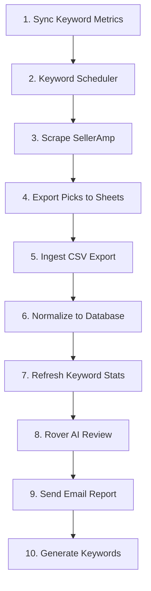

<p align="center">
  
</p>

<p align="center">
  <strong>An autonomous agent that finds, reviews, and reports Amazon arbitrage product candidates.</strong>
</p>

---

Rover hunts for profitable products to resell on Amazon. On each run, it picks keywords to look into, scrapes [SellerAmp](https://selleramp.com) for candidates, normalizes the data, reviews every product, and emails you a shortlist explaining its picks. It then generates fresh keywords so the next run searches smarter than the last.

The system is intentionally **file-and-SQLite based** with no web UI, so the entire system can run unattended on a single VPS using `cron`.

## ✨ Highlights

- **Closed feedback loop**. Top picks feed keyword generation, so Rover's search space improves over time.
- **AI product review**. Every candidate is judged by an agent that researches sourcing and cost before deciding whether to `keep` or `reject`.
- **Bi-daily email reports**. Delivers a ranked shortlist with per-product analysis and a run-level breakdown.
- **Built to run unattended**. Self-healing locks and loud alerts to catch silent crashes.

## ⚙️ How Rover works

`rover/pipeline.py` orchestrates each run through ten sequential stages:



Here's a more detailed explanation of each stage:

| #   | Stage                      | Explanation                                                                                                                       |
| --- | -------------------------- | --------------------------------------------------------------------------------------------------------------------------------- |
| 1   | **Sync Keyword Metrics**   | Recompute each keyword's winner rate and lifecycle state (`active`, `cooldown`, `retired`) from previous runs.                    |
| 2   | **Keyword Scheduler**      | Score eligible keywords and pick a small set per run, ensuring a balanced mix of manual, proven, mutated, new, and retried terms. |
| 3   | **Scrape SellerAmp**       | Scrape SellerAmp, filter listings (enforce minimum offers, estimated sales, and cost), and skip ASINs already seen.               |
| 4   | **Export Picks to Sheets** | Export candidates to a Google Sheet.                                                                                              |
| 5   | **Ingest CSV Export**      | Download a CSV snapshot into the raw data directory.                                                                              |
| 6   | **Normalize to Database**  | Parse and validate CSV into product records. Insert everything into SQLite.                                                       |
| 7   | **Refresh Keyword Stats**  | Recompute stats given the new products.                                                                                           |
| 8   | **Rover AI Review**        | Review each pending product. Pull records over MCP, research sourcing and cost on the web, and return a decision + analysis.      |
| 9   | **Send Email Report**      | Send an HTML/text report built from the latest run over SMTP.                                                                     |
| 10  | **Generate Keywords**      | Create new keywords by altering proven keywords and "winning" product titles. Queue them for future runs.                         |

## 🗂️ Structure

```text
├── rover/
│   ├── agent/             # Rover's LLM product-review logic
│   ├── keywords/          # keyword scheduling, stats, generation, embeddings
│   ├── products/          # Google Sheet sync and product normalization
│   ├── reports/           # email report data, rendering, and delivery
│   ├── scraping/          # SellerAmp scraping and Chrome/Selenium support
│   ├── pipeline.py        # orchestrator: runs the ten stages
│   ├── pipeline_lock.py   # self-healing run lock
│   ├── pipeline_alerts.py # failure alerts
│   └── doctor.py          # health check
├── scripts/               # thin command wrappers (cron/manual entry points)
├── mcp/                   # local MCP server that exposes the DB to the agent
├── config/                # YAML configuration and example templates
└── docs/                  # deployment guide and misc
```

## 📋 Requirements

- **Python 3.13+**
- **Google Chrome Profile** (with the SellerAmp extension)
- **Google Service Account**
- **OpenRouter API Key**
- **SMTP Account**

## 🚀 Quickstart

1. Create and activate a **Python 3.13** virtual environment, then install dependencies:

```bash
python3.13 -m venv .venv
.venv/bin/python -m pip install --upgrade pip
.venv/bin/python -m pip install -r requirements.txt
```

2. Generate **config files** from the templates:

```bash
cp config/data.example.yaml config/data.yaml
cp config/scraper.example.yaml config/scraper.yaml
cp config/agent.example.yaml config/agent.yaml
cp config/email_report.example.yaml config/email_report.yaml
cp config/keyword_policy.example.yaml config/keyword_policy.yaml
```

3. Create `.env` from the example:

```bash
cp .env.example .env
```

4. Run **health check**, then the pipeline:

```bash
.venv/bin/python scripts/doctor.py
.venv/bin/python scripts/run_pipeline.py
```

## 🤖 Running Rover

Use `scripts/run_pipeline.py` to run the full pipeline:

```bash
.venv/bin/python scripts/run_pipeline.py
```

Each stage can be run on its own for debugging. For example:

```bash
## ** running scraper only
.venv/bin/python scripts/product_scraper.py
```

### Scheduling

Use `cron` to run Rover twice per day:

```cron
0 6,20 * * * cd /path/to/rover && /path/to/rover/.venv/bin/python scripts/run_pipeline.py >> /path/to/rover/logs/pipeline.log 2>&1
```

## 🛡️ Reliability

Rover is designed to survive unattended operation:

- **Self-healing lock**. Heartbeats keep active locks fresh. Crashed runs are auto-reclaimed on the next start to prevent deadlocks. Active runs prevent concurrent ones.
- **Failure alerts**. Failures trigger an email alert with the tail of the latest log.
- **Structured logs**. Each run writes a human-readable `pipeline_<timestamp>.log`.

## ⚖️ License

MIT
